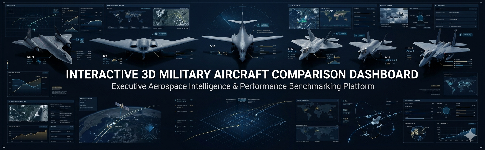

# ✈️ Interactive 3D Military Aircraft Comparison Dashboard

Executive Aerospace Intelligence Dashboard comparing some of the world's most iconic military aircraft through interactive visualizations, benchmarking analytics, and strategic performance assessment.

## Aircraft Included

* SR-71 Blackbird
* B-2 Spirit
* B-1B Lancer
* F-22 Raptor
* F-35 Lightning II
* F-15EX Eagle II

## Key Features

* Interactive Aircraft Comparison
* Advanced Performance Benchmarking
* Strategic Mission Analysis
* Radar Capability Visualization
* Cost & Production Intelligence
* Aerospace Analytics Dashboard

## Live Dashboard

https://urstrulyghc-5.github.io/interactive-3d-military-aircraft-comparison-dashboard/

## Technology Stack

* HTML5
* CSS3
* JavaScript
* Interactive Data Visualization

## Project Objective

This project demonstrates aerospace intelligence analysis through an interactive dashboard that benchmarks aircraft performance, mission roles, manufacturing data, and operational capabilities.
