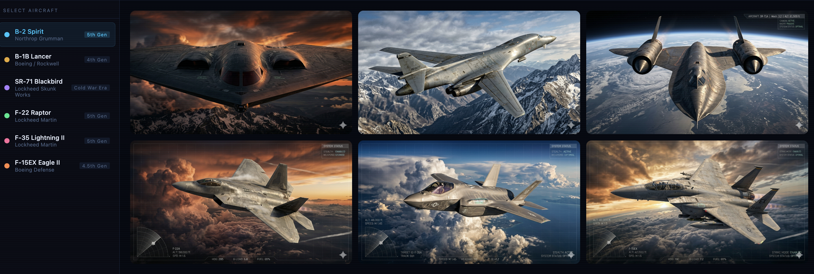
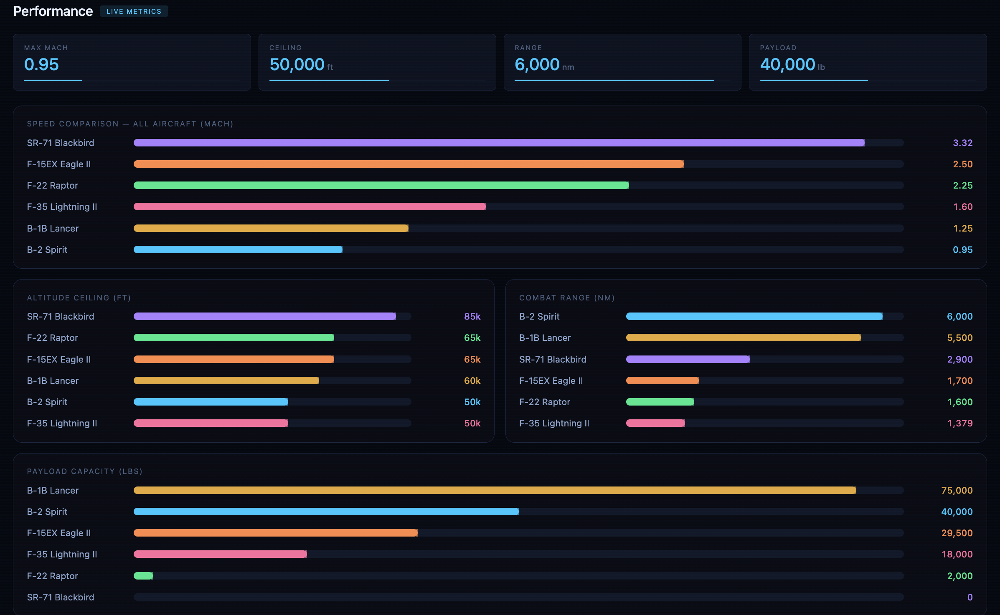
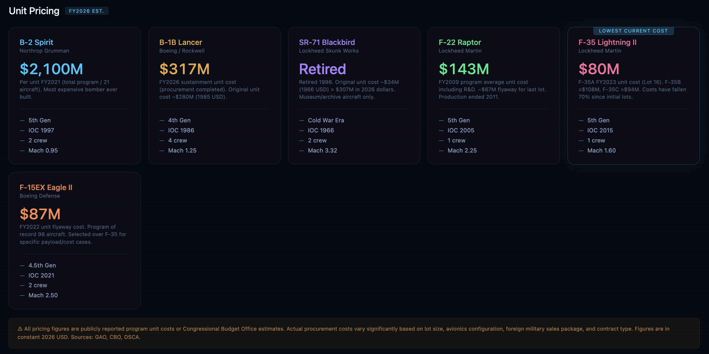
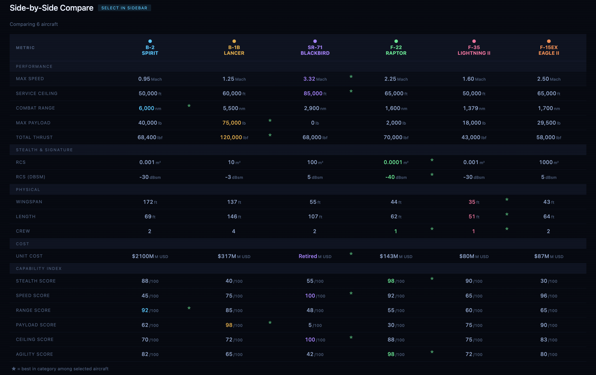

# ✈️ Interactive 3D Military Aircraft Comparison Dashboard

### Aerospace Intelligence • Strategic Capability Assessment • Defense Analytics

An advanced aerospace intelligence platform designed to benchmark and compare six of the world's most iconic military aircraft through interactive visualization, performance analytics, mission-role assessment, procurement intelligence, and strategic capability evaluation.

---

## 🌐 Live Experience

### Dashboard
👉 https://urstrulyghc-5.github.io/interactive-3d-military-aircraft-comparison-dashboard/

### Repository
👉 https://github.com/urstrulyghc-5/interactive-3d-military-aircraft-comparison-dashboard

---

## 📸 Platform Preview

### Executive Overview Dashboard


### Performance Intelligence


### Capability Assessment Matrix


### Procurement & Cost Intelligence


### Strategic Aircraft Benchmarking


---

# 🎯 Executive Summary

Modern military aviation platforms are designed for fundamentally different strategic missions.

This dashboard consolidates aircraft performance, operational capability, mission effectiveness, procurement economics, and platform characteristics into a single intelligence-driven comparison environment.

The objective is to provide a visual benchmarking framework that allows users to evaluate aircraft across multiple dimensions rather than relying on isolated performance statistics.

---

# ✈️ Aircraft Intelligence Coverage

| Platform | Manufacturer | Primary Role |
|-----------|-------------|-------------|
| SR-71 Blackbird | Lockheed Skunk Works | Strategic Reconnaissance |
| B-2 Spirit | Northrop Grumman | Stealth Strategic Bomber |
| B-1B Lancer | Rockwell International | Supersonic Strategic Bomber |
| F-22 Raptor | Lockheed Martin | Air Superiority Fighter |
| F-35 Lightning II | Lockheed Martin | Multirole Stealth Fighter |
| F-15EX Eagle II | Boeing Defense | Heavy Strike Fighter |

---

# 📊 Intelligence Modules

## Aircraft Overview

Comprehensive aircraft profiles including:

- Manufacturer
- Entry Into Service
- Aircraft Generation
- Strategic Role
- Fleet Information

---

## Performance Analytics

Interactive benchmarking of:

- Maximum Speed
- Service Ceiling
- Combat Range
- Payload Capacity
- Operational Reach
- Mission Performance

---

## Capability Assessment

Radar-based visualization framework evaluating:

- Stealth
- Mobility
- Strike Capability
- Survivability
- Operational Flexibility
- Strategic Value

---

## Mission Profile Analysis

Evaluate aircraft suitability for:

- Strategic Reconnaissance
- Air Superiority
- Deep Strike Operations
- Strategic Bombing
- Precision Engagement
- Multi-Role Operations

---

## Procurement Intelligence

Compare:

- Unit Acquisition Cost
- Fleet Size
- Production Volume
- Program Scale
- Platform Economics

---

## Strategic Comparison Engine

Interactive side-by-side benchmarking environment enabling rapid evaluation across multiple performance dimensions.

---

## Custom Weighted Ranking System

Dynamic ranking engine allowing users to prioritize specific operational factors and generate personalized aircraft rankings.

---

# 🛠 Technology Stack

| Layer | Technology |
|---------|-----------|
| Frontend | HTML5 |
| Styling | CSS3 |
| Logic | JavaScript |
| Visualisation | SVG & Interactive Components |
| Deployment | GitHub Pages |

---

# 📁 Repository Architecture

```text
interactive-3d-military-aircraft-comparison-dashboard
│
├── index.html
├── README.md
├── LICENSE
│
├── assets
│   ├── hero-banner.png
│   ├── sr71.png
│   ├── b2.png
│   ├── b1b.png
│   ├── f22.png
│   ├── f35.png
│   └── f15ex.png
│
├── screenshots
│   ├── overview.png
│   ├── performance.png
│   ├── features.png
│   ├── pricing.png
│   └── comparison.png
│
└── docs
    └── project-overview.md
```

---

# 🌍 Potential Applications

- Aerospace Research
- Defense Intelligence
- Aviation Education
- Strategic Capability Analysis
- Data Visualization Demonstrations
- Military Technology Benchmarking
- Interactive Dashboard Design

---

# 🚀 Future Enhancements

- Aircraft Timeline Visualizations
- Historical Fleet Analysis
- Advanced Radar Simulations
- Global Operator Mapping
- Interactive 3D Aircraft Models
- Exportable Intelligence Reports

---

# 👨‍💻 Author

## G Hari Charan

MBA Graduate | Aerospace Intelligence Enthusiast | Data Visualization Projects

This project was independently developed to explore the intersection of aerospace intelligence, strategic analysis, interactive dashboards, and modern web-based visualization techniques.

GitHub:
https://github.com/urstrulyghc-5

---

# 📄 License

Licensed under the MIT License.
